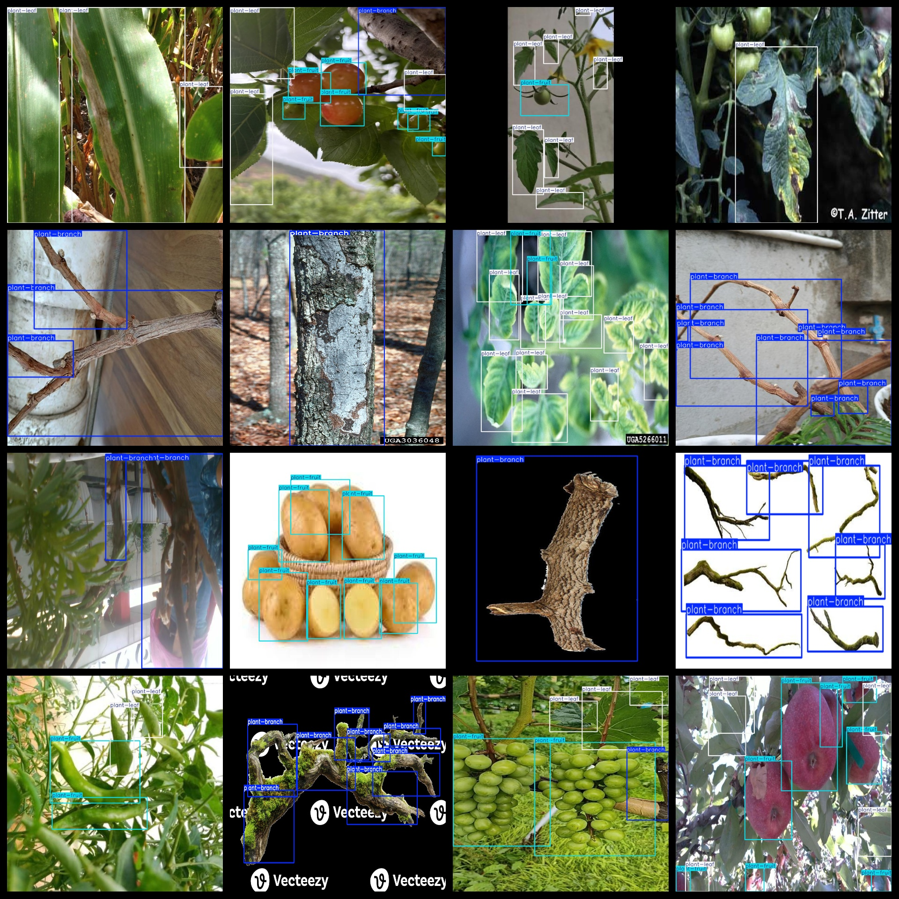

# Plant tree branch Leaf Fruit Detection Dataset 7220 imagesVOC+YOLO format

Plant branch leaf fruit detection dataset 7220 VOC + YOLO format

Dataset format: Pascal VOC format + YOLO format (the txt file does not contain the split path, it only contains jpg images and corresponding VOC format xml files and yolo format txt files)

Number of images (number of jpg files): 7220

Number of xml files: 7220

Number of txt files: 7220

Number of annotated categories: 3

The Github repository is: datasets_sl

['plant-branch', 'plant-fruit', 'plant-leaf']

Number of boxes labeled in each category:

The plant-branch frame count is 15795.

The number of plant-fruit frames is 15860.

Plant-leaf frame count = 17595

Total frame count: 49250

Number of images per category:

Plant-branch occupancy = 2600

plant-fruit annotated images = 3297

Plant-leaf possessions number = 3654

Resolution of the image: Multi-resolution images, such as 800x800, 640x640 and so on.

Use the labeling tool: labelImg

Dataset Augmentation: Yes

Rules for annotation: Draw a rectangle around the category.

Important note: The dataset does not have been divided into training, validation, and testing sets.

Special Disclaimer: This dataset does not guarantee the accuracy of the trained models or weight files.

Annotation and image details are as follows:

## Images

---

Here is a pay link on Stripe (https://buy.stripe.com/3cs8yP7sY87d0vu9AB). Please contact me lonlonago@foxmail.com after funding $89, and I will send you a complete data files, thank you!

